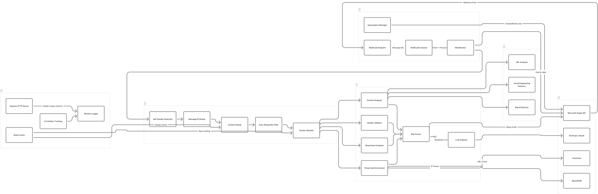
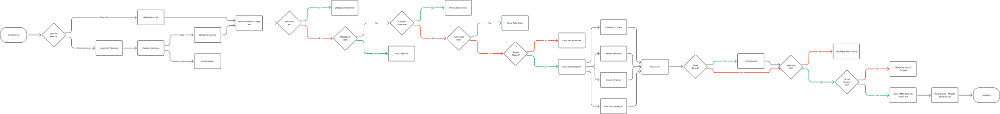

# Architecture Diagrams

Visual diagrams of the Phishing Agent system architecture and email processing workflow.

## System Architecture

High-level component diagram showing all system modules and their connections.

**FigJam board:** [Open in Figma](https://www.figma.com/online-whiteboard/create-diagram/41babfb4-13fa-4991-87d5-182163fa9c46)

**Components shown:**

- **Email Ingestion** -- Webhook endpoint, subscription manager, mail monitor, notification queue
- **Guard Layers** -- Self-sender detection, message ID dedup, content dedup, auto-responder filter, sender allowlist
- **Analysis Pipeline** -- Header validation, content analysis, attachment analysis, threat intel enrichment, risk scoring, LLM explanation
- **External Services** -- Microsoft Graph API, VirusTotal, AbuseIPDB, Anthropic Claude
- **Infrastructure** -- Express HTTP server, Redis cache, Winston logger, correlation tracking

## Email Processing Workflow

Detailed flowchart from email arrival through guard checks, analysis, and reply.

**FigJam board:** [Open in Figma](https://www.figma.com/online-whiteboard/create-diagram/c04445a2-e595-4df5-b767-fb17eb284132)

**Flow highlights:**

- Dual ingestion: webhook push (real-time) or timer poll (fallback)
- 5 guard layers filter before analysis runs
- Header, content, attachment, and threat intel analysis run in parallel
- LLM explanation only triggers for borderline scores (4.0-6.0)
- Rate limiter and circuit breaker protect reply sending
